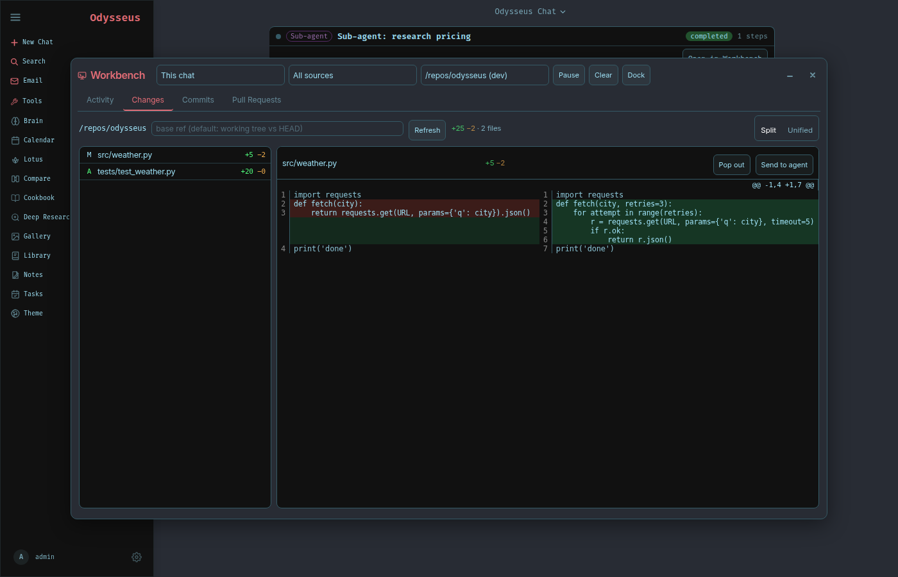
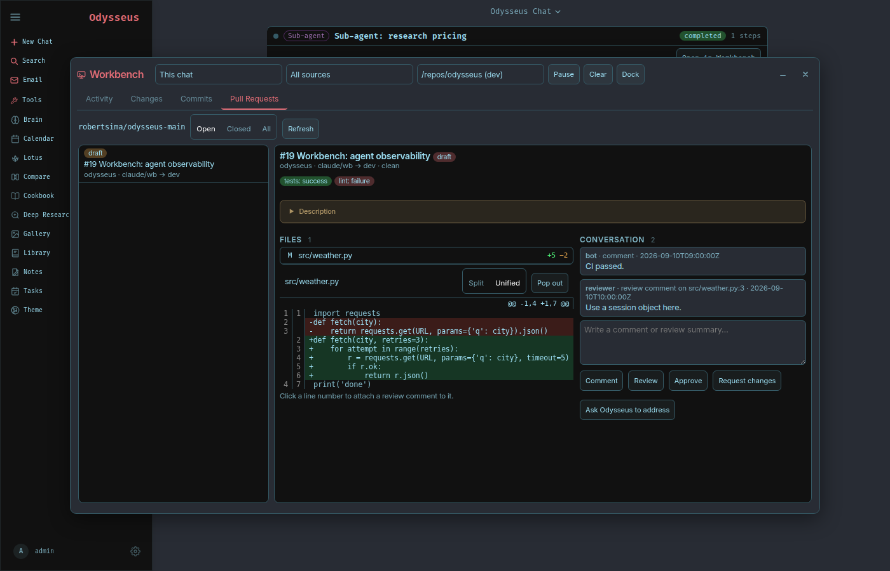

# Workbench: agent observability, changes, commits and pull requests

The Workbench is the window that shows what the agents are doing while they do
it. Open it from the rail (the terminal icon) or let it open itself the first
time a run starts in the current chat.

## What it shows

**Activity** is one feed for every process that works on a chat:

| Source | What publishes it |
|---|---|
| Odysseus | every agent turn: tool calls, results, errors, the final answer |
| Claude Code | `delegate_to_claude_code` runs, live from the CLI's stream-json transcript |
| Sub-agent | `send_to_session` with `mode: "agent"`: a full agent run inside another session |
| Pipeline | multi-model pipelines (`do_pipeline`), one event per step |
| Background job | the follow-up turn that continues a chat after a background command finishes |
| Worktree | comments and reviews posted on pull requests from the Workbench |

Runs group their events. Running runs sit at the top with a live duration;
finished runs keep their tool count, files changed and commit count. Any run
opens its own event list, and Claude Code runs open straight into their
changes or their transcript.

The scope selector follows the current chat by default. "All sessions" shows
everything, which is how you watch a sub-agent working in another session.

**Changes** lists the files a run touched, or the working tree of any approved
repository, with a side-by-side "old vs new" view or a classic unified diff.
Pop any file out into its own window. "Send to agent" drops the diff into the
composer so Odysseus can review it; clicking a line number drops that line.

**Commits** lists commits since a run started, or the repository log, with the
full message and per-file diffs.

**Pull Requests** uses the worktree GitHub credential (see
`docs/agent-worktree.md`) to list the repository's pull requests with checks,
files, comments and reviews. Comment, approve or request changes from the
window. Clicking a line number in a PR file attaches a review comment to that
line. "Ask Odysseus to address" writes a prompt with the failing checks and the
latest review comments into the composer.

## Runs inside the chat

When a Claude Code run, sub-agent, pipeline or background job starts for the
open chat, a card appears in the conversation and fills in step by step. It
stays with the turn after the run ends, with "View changes" and "Open in
Workbench".

## Settings

Settings → Tools → Workbench:

- **Workbench window** hides the rail button and stops the feed.
- **Auto-open on delegation** opens the window when a run starts.
- **Live Claude Code transcript** runs the CLI with `--output-format
  stream-json`. When the installed CLI does not support it, runs fall back to
  the plain result, and the run card says so.

## API

All routes require an admin session.

| Route | Purpose |
|---|---|
| `GET /api/workbench/activity?session_id=&since=&limit=` | bounded history of a session's events |
| `GET /api/workbench/activity/stream?session_id=&since=` | server-sent events; `session_id=*` for all sessions |
| `GET /api/workbench/runs`, `/runs/{run_id}` | run registry and one run's events |
| `GET /api/workbench/repo/roots` | inspectable repositories |
| `GET /api/workbench/repo/status|changes|diff|file|commits|commit` | git inspection, path-confined to approved roots |
| `GET /api/workbench/prs/config`, `/prs`, `/prs/{n}`, `/prs/{n}/diff` | pull requests via the worktree credential |
| `POST /api/workbench/prs/{n}/comment`, `/prs/{n}/review` | post a comment or a review (`COMMENT`, `APPROVE`, `REQUEST_CHANGES`) |
| `GET /api/claude-code/tasks/{id}/changes`, `/diff` | what a Claude Code run changed |

Events persist as JSONL under `DATA_DIR/agent_activity/` so history survives a
restart. Git runs argv-only with the repository path confined to the Claude
Code roots, the worktree root, the source repository and the active workspace.
